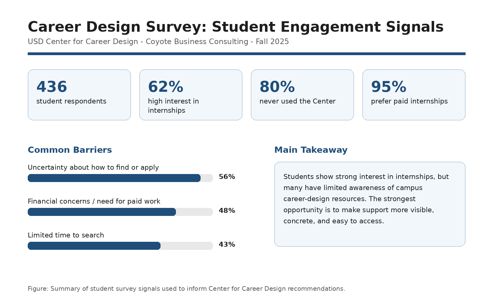
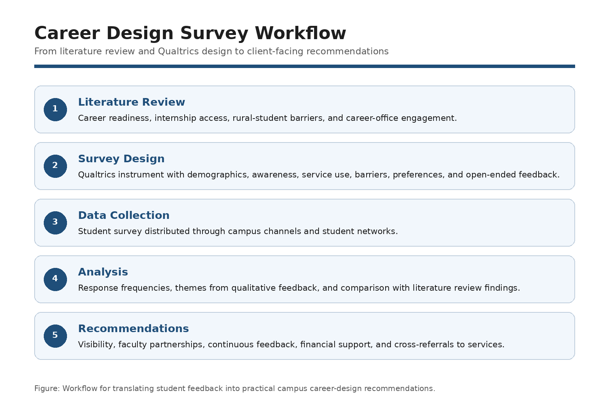
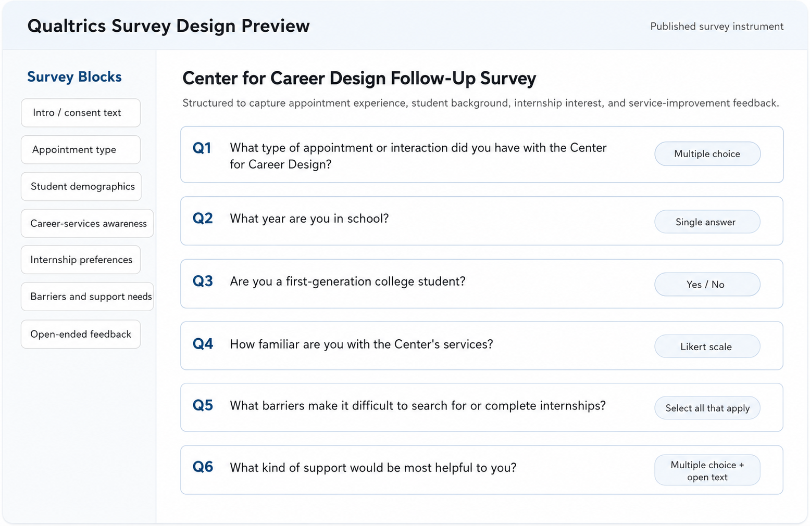

# Student Internship Engagement and Career Services Survey

**Project type:** Survey research / internal consulting 
**Tools:** Qualtrics, literature review, survey design, descriptive analysis, stakeholder recommendations 
**Status:** Completed Coyote Business Consulting project 
**My role:** Two-person consulting team; survey design, analysis, writing, and recommendations

[← Back to Projects](../projects.html)

## Summary

This project helped USD’s Center for Career Design evaluate student perceptions of internships and campus career resources. The project combined a literature review with a student survey administered through Qualtrics. The final report identified a gap between strong student interest in internships and comparatively low engagement with the Center’s services.

The project was designed as an internal consulting engagement. The goal was to use student feedback to help the Center better understand awareness, barriers, and support needs related to internship participation.

## Problem / Research Question

How do USD students perceive internships and career-development resources, and what barriers keep students from using available career-support services?

## Data and Methods

The project combined national research on career readiness and internships with a student survey distributed across campus. The survey asked students about internship interest, awareness of the Center for Career Design, barriers to participation, preferred forms of support, and confidence in finding internships.

Methods included:

* Literature review
* Qualtrics survey design
* Survey distribution
* Descriptive analysis of student responses
* Interpretation of qualitative feedback
* Recommendation development
* Poster and final report preparation

## Key Findings

The survey showed strong interest in internships but limited engagement with the Center for Career Design. Many students were interested in completing internships before graduation, yet many had not used the Center’s services. The project identified awareness, affordability, and alignment as key themes affecting student engagement.

Students reported valuing paid internships, meaningful skill-building experiences, mentorship, clear expectations, and employer connections. Major barriers included uncertainty about how to find or apply for internships, financial concerns, lack of time, and transportation or location challenges.

## Why This Project Matters

This project demonstrates applied survey research and internal consulting. It also shows how student feedback can be translated into actionable recommendations for a campus office. The project is relevant to customer insights, market research, program evaluation, HR analytics, and stakeholder communication.

## Skills Demonstrated

* Survey design
* Qualtrics
* Literature review
* Descriptive analysis
* Qualitative feedback interpretation
* Stakeholder recommendations
* Internal consulting
* Professional writing
* Presentation design

## Artifacts

* [Final project report](../assets/files/career-design-survey/career-design-survey-report.pdf)
* [One-page project brief](../assets/files/career-design-survey/career-design-survey-brief.pdf)
* [Survey methods note](../assets/files/career-design-survey/career-design-survey-methods-note.pdf)

*Note: Raw survey responses are not included in this public portfolio package. The public artifacts summarize the survey design, findings, and recommendations without publishing identifiable student-level response data.*

## Selected Visuals

*Figure: Summary of the project’s main findings and recommendation areas.*

*Figure: Workflow from literature review and survey design to analysis and stakeholder recommendations.*

*Figure: Portfolio recreation of the Qualtrics survey structure delivered for the Center for Career Design project.*
