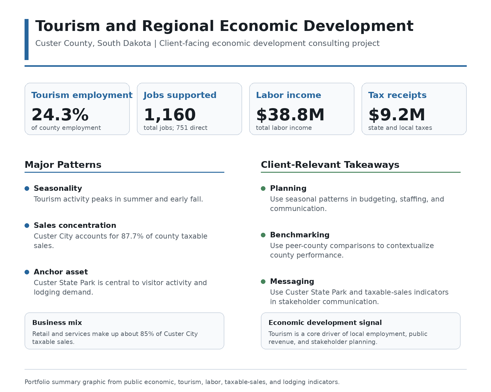
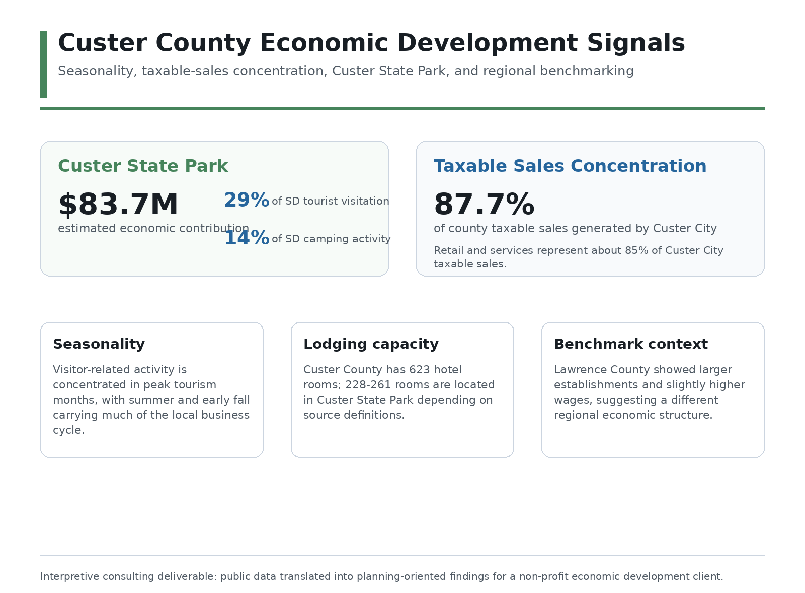

# Tourism and Regional Economic Development in Custer County

**Project type:** Client-facing consulting / regional economic analysis
**Tools:** Excel, public economic data, BLS/QCEW data, FRED/BEA data, taxable sales data, tourism indicators, regional benchmarking
**Status:** Completed Coyote Business Consulting project
**Client:** Custer Area Economic Development Foundation
**My role:** Team consultant; interpretation, writing, presentation, and selected data organization/analysis support

[← Back to Projects](../projects.html)

## Summary

This project analyzed tourism’s role in the economy of Custer County, South Dakota for the Custer Area Economic Development Foundation. The project combined publicly available economic, labor-market, taxable-sales, lodging, tourism, and regional benchmark data to help the client better understand how visitor activity shapes local business activity, tax revenue, employment, and regional economic-development planning.

The final deliverables were designed for a client audience rather than a purely academic audience. The goal was to turn public data into practical findings that could support local economic-development conversations.

## Role Note

This was a team consulting project. Because I was sick during the early part of the project, my strongest contributions came later in the semester through interpretation, writing, presentation development, and helping translate the analysis into client-facing recommendations. The technical workbook included here is a cleaned portfolio demonstration of the public-data workflow rather than a claim that I independently completed every technical step of the original team project.

## Problem / Research Question

How important is tourism to Custer County’s economy, and what patterns in employment, taxable sales, lodging capacity, public attractions, and regional economic indicators should inform future economic-development planning?

## Data and Methods

The project used publicly available data from sources such as state government tourism reports, taxable-sales data, labor-market data, BLS/QCEW-style industry data, FRED/BEA regional economic data, and other public economic datasets. The analysis focused on identifying practical patterns rather than building a purely academic econometric model.

Methods included:

* Public-data collection and organization
* Tourism and hospitality indicator review
* Regional benchmarking
* Taxable-sales and labor-market interpretation
* Public attraction and lodging-capacity analysis
* Client-facing synthesis
* Presentation of findings and recommendations

## Key Findings

The project found that tourism is a central part of Custer County’s local economic base. Visitor activity affects lodging, restaurants, retail activity, taxable sales, and seasonal employment patterns. The analysis also highlighted that tourism-dependent communities face tradeoffs: visitor activity supports local business and tax revenue, but seasonal demand, housing pressures, workforce constraints, and infrastructure needs can complicate long-term planning.

## Why This Project Matters

This project demonstrates applied business and economic consulting for a real client. It shows how public data can be transformed into practical insights for local decision-makers, and how analysis can support economic-development strategy in a smaller regional economy.

## Skills Demonstrated

* Regional economic analysis
* Public-data collection and organization
* Excel-based analysis
* BLS/QCEW and regional data workflow
* Tourism and taxable-sales interpretation
* Client-facing report writing
* Presentation development
* Economic-development communication
* Team-based consulting

## Artifacts

* [Final consulting report](../assets/files/custer-economic-development/custer-economic-development-report.pdf)
* [Presentation slides](../assets/files/custer-economic-development/custer-economic-development-slides.pdf)
* [One-page project brief](../assets/files/custer-economic-development/custer-economic-development-brief.pdf)
* [Cleaned public data workbook demo](../assets/files/custer-economic-development/custer-public-data-workbook-demo.xlsx)

*Note: The workbook is a cleaned portfolio demonstration of the public-data workflow. It highlights how public sources such as BLS/QCEW and FRED/BEA data were organized for analysis; it is not intended to reproduce every raw working file used during the client project.*

## Selected Visuals

*Figure: Summary of tourism-related economic indicators and local development implications.*

*Figure: Selected regional economic-development signals from the Custer analysis.*
