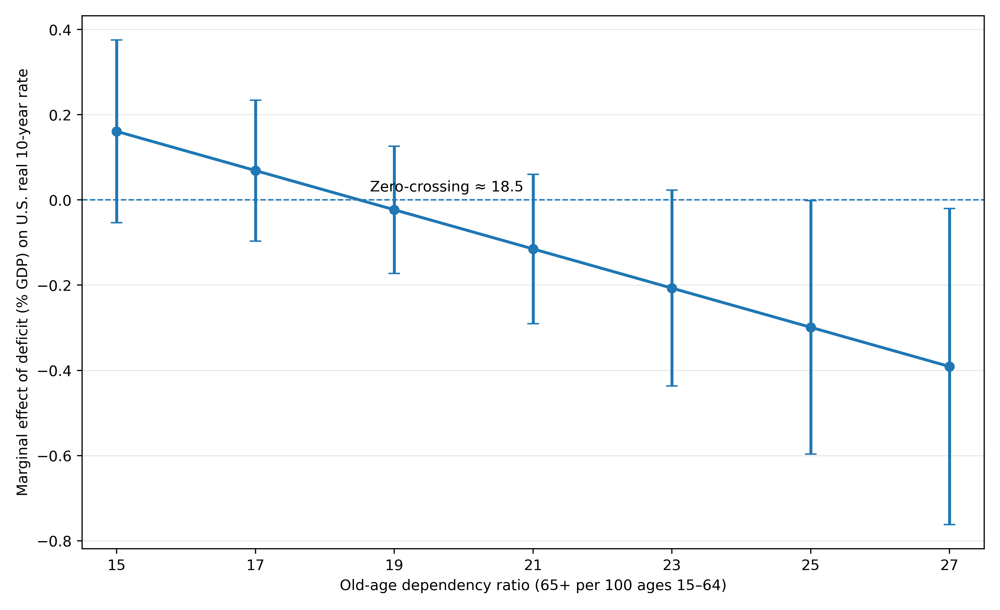

# Federal Deficits, Demographic Aging, and Long-Term Real Interest Rates

**Project type:** Honors thesis / econometric research  
**Tools:** Stata, Excel, macroeconomic time-series data  
**Status:** Completed undergraduate honors thesis  
**My role:** Individual researcher  

[← Back to Projects](../projects.html)

## Summary

This honors thesis examines how federal budget deficits, demographic aging, and global financial conditions relate to U.S. long-term real interest rates. The project combines macroeconomic theory, historical data collection, econometric modeling, and policy interpretation to evaluate whether federal deficits are associated with higher real long-term interest rates and how that relationship changes as the U.S. population ages.

## Research Question

How do federal budget deficits affect U.S. long-term real interest rates, and does demographic aging alter that relationship?

## Data and Methods

The project uses annual U.S. macro-financial data and estimates regression models relating the real 10-year Treasury rate to federal deficits, demographic aging, and additional domestic and global controls.

Methods included:

- Time-series data collection and cleaning
- Interaction modeling
- Robust and Newey-West standard errors
- Marginal-effects interpretation
- Split-sample analysis
- Stata-based regression workflow

## Key Findings

The project found evidence that the relationship between federal deficits and real long-term interest rates changes across demographic and global financial contexts. Earlier periods showed stronger evidence of traditional crowding-out dynamics, while later periods suggested that demographic aging and global capital markets may have altered the deficit-interest-rate relationship.

## Why This Project Matters

This project demonstrates my ability to move from a broad public finance question to a structured empirical research design. It also shows my ability to connect economic theory, statistical modeling, and policy implications in a long-form research project.

## Skills Demonstrated

- Econometric research design
- Macroeconomic and public finance analysis
- Stata programming
- Data cleaning and documentation
- Regression interpretation
- Academic writing
- Policy-oriented communication

## Artifacts

- [Final thesis PDF](../assets/files/thesis/honors-thesis-deficits-aging-real-rates.pdf)
- [Thesis defense slides](../assets/files/thesis/honors-thesis-defense-slides.pdf)
- [Cleaned Stata code folder on GitHub](https://github.com/tysonctest/tysonctest.github.io/tree/main/assets/code/thesis)

## Code Files

The cleaned Stata workflow is documented in the README and split into modular `.do` files:

- [Code README](../assets/code/thesis/)
- [run_all.do](../assets/code/thesis/run_all.do)
- [01_build_analysis_dataset.do](../assets/code/thesis/01_build_analysis_dataset.do)
- [02_descriptives.do](../assets/code/thesis/02_descriptives.do)
- [03_regressions_main.do](../assets/code/thesis/03_regressions_main.do)
- [04_regressions_alternate.do](../assets/code/thesis/04_regressions_alternate.do)
- [05_regressions_one_change_at_a_time.do](../assets/code/thesis/05_regressions_one_change_at_a_time.do)
- [06_export_tables.do](../assets/code/thesis/06_export_tables.do)
- [07_prepost_capflows.do](../assets/code/thesis/07_prepost_capflows.do)

## Selected Visual

*Figure: Estimated marginal effect of federal deficits on U.S. real 10-year Treasury rates across the old-age dependency ratio.*
