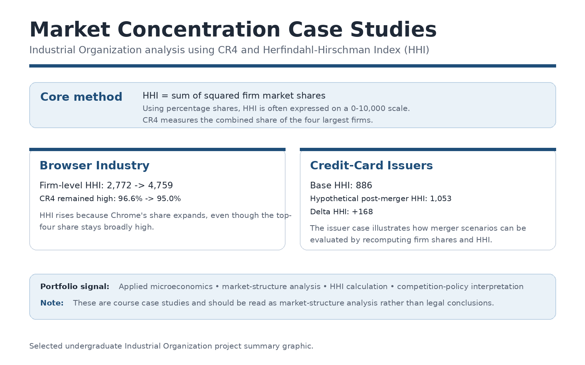
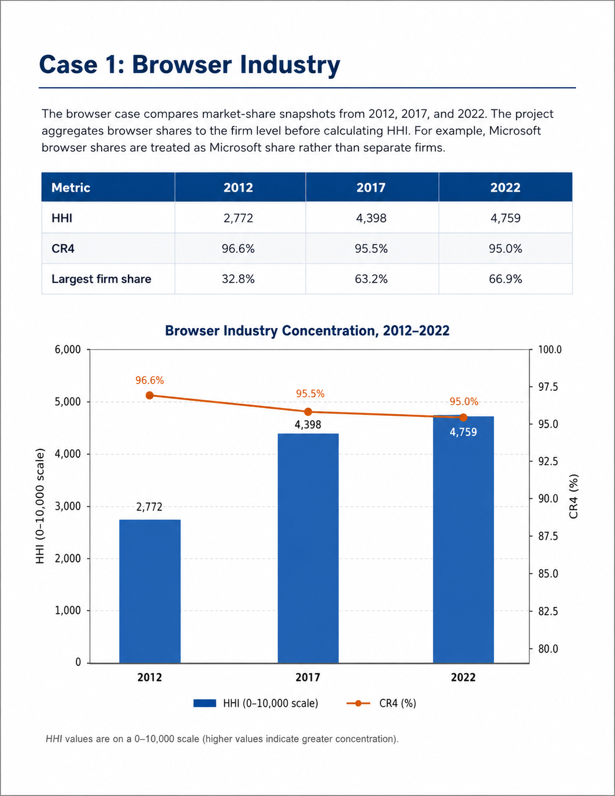
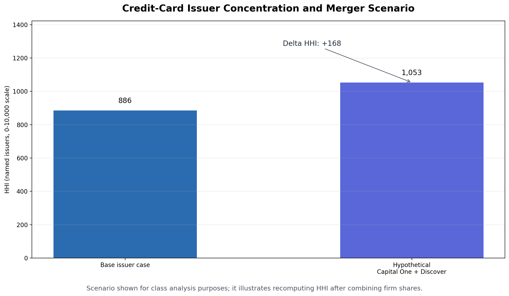

# Market Concentration Case Studies: Browser and Financial Services Industries

**Project type:** Industrial Organization / market-structure analysis 
**Tools:** Excel, HHI, CR4, market-share analysis, scenario analysis 
**Status:** Completed ECON-450 Industrial Organization case studies 
**My role:** Individual analyst; spreadsheet modeling, interpretation, and written analysis

[← Back to Projects](../projects.html)

## Summary

This project applied Industrial Organization concepts to market concentration case studies in the browser and financial services industries. The analysis used concentration metrics, such as the four-firm concentration ratio (CR4) and the Herfindahl-Hirschman Index (HHI), to evaluate how market structure varies across industries and scenarios.

The browser case examined how concentration changed as Google Chrome expanded its market share. The financial-services case used credit-card issuer shares to analyze baseline concentration and a hypothetical consolidation scenario.

## Problem / Research Question

How can market-share data and concentration metrics be used to evaluate industry structure, firm dominance, and changes in concentration under consolidation scenarios?

## Data and Methods

The project used market-share data from course case-study spreadsheets. Shares were organized in Excel and converted into concentration metrics.

Methods included:

* Market-share organization and cleaning
* Firm-level aggregation where needed
* CR4 calculation
* HHI calculation
* Scenario analysis using recomputed firm shares
* Comparison of concentration metrics across markets
* Written interpretation of what the metrics reveal and what they do not prove

## Key Findings

The browser case showed that CR4 can remain high and relatively stable while HHI rises sharply. This is important because HHI captures the increasing dominance of one firm inside an already concentrated leading group.

The credit-card issuer case showed how a hypothetical merger or consolidation scenario can be evaluated by combining firm shares and recomputing HHI. The scenario increased the HHI, illustrating how concentration metrics can be used to structure merger-style analysis.

## Why This Project Matters

This project demonstrates applied microeconomic reasoning and antitrust-style market-structure analysis. It also shows how a simple spreadsheet model can turn market-share data into interpretable measures of industry concentration.

The project is especially useful for showing that quantitative metrics need careful interpretation: CR4, HHI, and delta HHI each answer different questions, and none of them alone proves market power, consumer harm, or legal liability.

## Skills Demonstrated

* Industrial Organization analysis
* HHI and CR4 calculation
* Market-share data organization
* Firm-level aggregation
* Scenario analysis
* Spreadsheet-based modeling
* Competition-policy interpretation
* Professional writing and explanation of quantitative findings

## Artifacts

* [Case-study report](../assets/files/market-concentration/market-concentration-case-studies.pdf)
* [One-page project brief](../assets/files/market-concentration/market-concentration-brief.pdf)
* [Methods note](../assets/files/market-concentration/market-concentration-methods-note.pdf)
* [Cleaned workbook demo](../assets/files/market-concentration/market-concentration-workbook-demo.xlsx)

*Note: The workbook is a cleaned portfolio demonstration of the HHI and CR4 calculation workflow. It is designed to show transparent spreadsheet logic and scenario analysis rather than serve as a legal or regulatory conclusion.*

## Selected Visuals

*Figure: Summary of the project’s market concentration methods and case-study findings.*

*Figure: Browser industry HHI and CR4 comparison across selected years.*

*Figure: Credit-card issuer HHI before and after a hypothetical consolidation scenario.*
