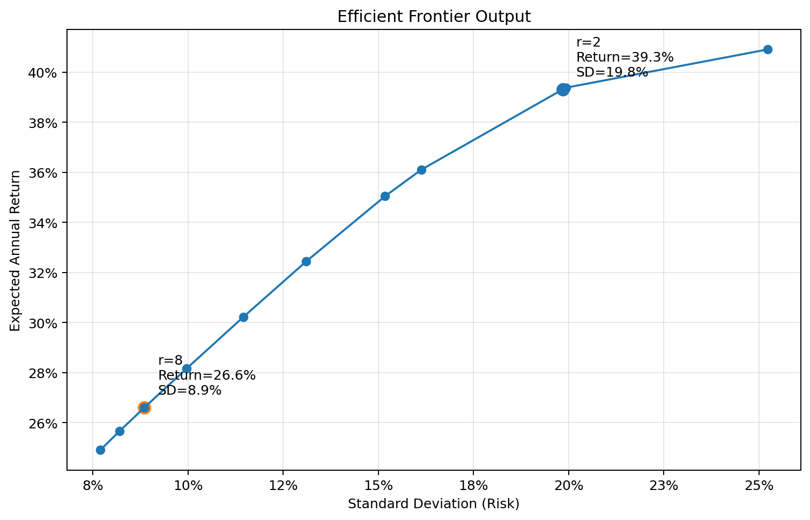
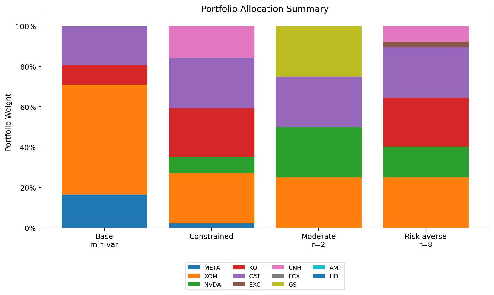
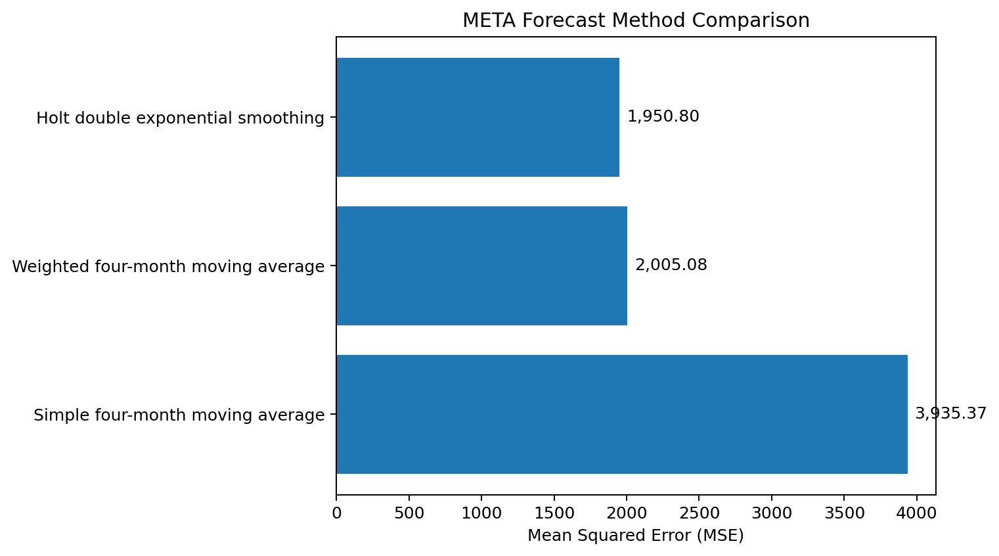

# Portfolio Optimization and Stock Price Forecasting Using Bloomberg Data

**Project type:** Prescriptive analytics / finance analytics group project 
**Tools:** Bloomberg Terminal, Excel, Solver/optimization add-in, forecasting methods 
**Status:** Completed DSCI-428 Prescriptive Analytics project 
**My role:** Full technical and written contributor

[← Back to Projects](../projects.html)

## Summary

This project used Bloomberg Terminal stock data, portfolio optimization, risk-aversion modeling, and stock-price forecasting to develop investment allocation recommendations. The project combined historical return analysis, covariance-matrix construction, mean-variance optimization, diversification constraints, efficient frontier analysis, and short-term forecasting for a selected equity.

## Problem / Research Question

How should a client allocate funds across a diversified set of stocks to achieve a target expected return while minimizing portfolio variance, accounting for diversification requirements and different levels of risk tolerance?

## Data and Methods

The project used five years of monthly stock-price data collected through Bloomberg Terminal. The team converted price data into annual returns, calculated average annual returns, and constructed a covariance matrix to model the risk relationships among the selected equities.

Methods included:

* Bloomberg Terminal data collection
* Annual return calculation
* Covariance matrix construction
* Mean-variance portfolio optimization
* Efficient frontier analysis
* Diversification constraints
* Risk-aversion modeling
* Forecast comparison using error metrics
* META stock-price forecasting

The optimization models included a base model, a constrained model, and additional risk-aversion scenarios. The constrained model limited any single stock to a maximum of 25 percent of the portfolio and required at least seven active investments.

## Key Findings

The project showed how different portfolio constraints and risk-aversion assumptions change the recommended allocation. The efficient frontier analysis illustrated the tradeoff between expected return and volatility, while the constrained model produced a more diversified portfolio than the base minimum-variance model.

The forecasting portion compared multiple approaches for META stock prices. Holt double exponential smoothing produced the lowest forecast error among the methods tested, making it the preferred short-term forecasting method for that stock.

## Why This Project Matters

This project demonstrates how prescriptive analytics can support investment decision-making. It also shows how optimization models can translate abstract financial objectives into specific recommended allocations while making tradeoffs among expected return, risk, and diversification clear.

## Skills Demonstrated

* Portfolio optimization
* Mean-variance analysis
* Efficient frontier interpretation
* Bloomberg Terminal data collection
* Excel-based optimization modeling
* Covariance matrix construction
* Forecast model comparison
* Financial decision support
* Consulting-style report writing

## Artifacts

* [Final project report](../assets/files/portfolio-optimization/portfolio-optimization-stock-forecasting.pdf)
* [Cleaned model demo workbook](../assets/files/portfolio-optimization/portfolio-optimization-model-demo.xlsx)

*Note: The workbook is a cleaned model demonstration and does not include raw Bloomberg export tabs.*

## Selected Visuals

*Figure: Efficient frontier showing the tradeoff between expected portfolio return and risk.*

*Figure: Portfolio allocation and risk-aversion model summary.*

*Figure: Forecast comparison for META stock-price forecasting.*
