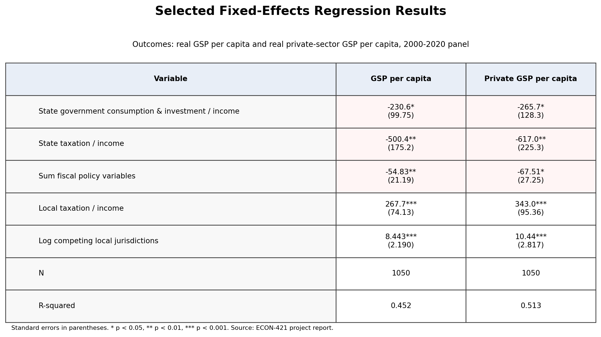

# State Fiscal and Regulatory Policy Effects on Economic Performance

**Project type:** Econometrics / public finance research  
**Tools:** Stata, Excel, fixed-effects regression, state-level policy, and economic data  
**Status:** Completed ECON-421 Econometrics project; presented at the Missouri Valley Economics Association, Kansas City, Fall 2024  
**My role:** Individual researcher and presenter  

[← Back to Projects](../projects.html)

## Summary

This project examined how state fiscal and regulatory policies relate to state-level economic performance. The analysis used state-level economic output data, population data, and policy variables from the Cato Institute’s *Freedom in the 50 States* report to evaluate whether fiscal and regulatory policy differences are associated with differences in gross state product and private-sector economic output.

This project served as an early applied econometrics research paper before my honors thesis and was presented at the Missouri Valley Economics Association in Kansas City in Fall 2024.

## Research Question

How do state fiscal and regulatory policies affect economic performance across U.S. states?

## Data and Methods

The project combined state economic data with fiscal and regulatory policy measures. Economic output measures included real gross state product and private-sector real gross state product adjusted for population. Policy measures included state government consumption and investment, tax burden measures, public-sector employment, occupational licensing indicators, compensation requirements for regulatory takings, and land-use regulation measures.

Methods included:

- State-level data collection
- Variable construction
- Per-capita economic output measures
- Fixed-effects regression
- Multicollinearity screening
- Public finance interpretation
- Conference-style presentation

## Key Findings

The project found that fiscal variables appeared more strongly related to economic performance than many of the regulatory variables tested. In particular, higher state government consumption and investment as a share of the state economy and higher tax burdens were associated with lower per-capita economic output measures in the project’s regressions. Several regulatory variables were not statistically significant in the models.

## Why This Project Matters

This project demonstrates applied econometric research on a real public finance question. It shows how state-level variation can be used to evaluate policy relationships and how regression results can be translated into public-policy interpretation. It also provided early experience presenting econometric research beyond the classroom through the Missouri Valley Economics Association.

## Skills Demonstrated

- Econometric modeling
- Fixed-effects regression
- State-level public finance analysis
- Policy variable construction
- Data cleaning
- Stata workflow
- Regression interpretation
- Research presentation
- Public-policy communication

## Artifacts

* [Presentation slides](../assets/files/public-finance-econometrics/public-finance-presentation-slides.pdf)
* [One-page research brief](../assets/files/public-finance-econometrics/public-finance-research-brief.pdf)
* [Data and methods note](../assets/files/public-finance-econometrics/public-finance-data-methods-note.pdf)
* [Cleaned Stata code folder on GitHub](https://github.com/tysonctest/tysonctest.github.io/tree/main/assets/code/public-finance-econometrics)

## Code Files

The cleaned Stata workflow is documented in the README and split into modular `.do` files:

* [Code README on GitHub](https://github.com/tysonctest/tysonctest.github.io/blob/main/assets/code/public-finance-econometrics/README.md)
* [run_all.do](https://github.com/tysonctest/tysonctest.github.io/blob/main/assets/code/public-finance-econometrics/run_all.do)
* [01_setup_and_panel.do](https://github.com/tysonctest/tysonctest.github.io/blob/main/assets/code/public-finance-econometrics/01_setup_and_panel.do)
* [02_summary_statistics.do](https://github.com/tysonctest/tysonctest.github.io/blob/main/assets/code/public-finance-econometrics/02_summary_statistics.do)
* [03_fixed_effects_regressions.do](https://github.com/tysonctest/tysonctest.github.io/blob/main/assets/code/public-finance-econometrics/03_fixed_effects_regressions.do)
* [04_export_tables.do](https://github.com/tysonctest/tysonctest.github.io/blob/main/assets/code/public-finance-econometrics/04_export_tables.do)

*Note: Raw class datasets are not included in this public portfolio package. The scripts are cleaned for portfolio review and document the general empirical workflow.*

## At a Glance

* **Course:** ECON-421 Econometrics
* **Conference presentation:** Missouri Valley Economics Association (MVEA), Kansas City, Fall 2024
* **Data:** 50 U.S. states over 2000–2020
* **Method:** State fixed-effects regressions
* **Main takeaway:** Fiscal variables were more consistently associated with economic performance than most regulatory variables tested.

## Selected Visuals

*Figure: Portfolio summary graphic for the public finance econometrics project.*

*Figure: Selected fixed-effects regression results.*

