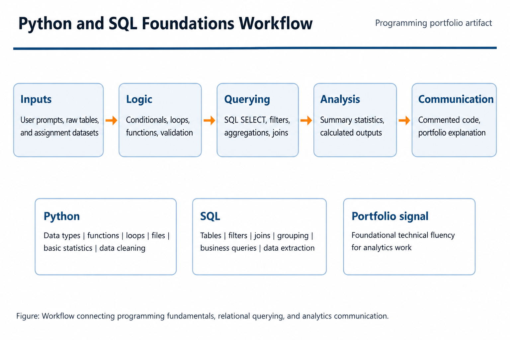
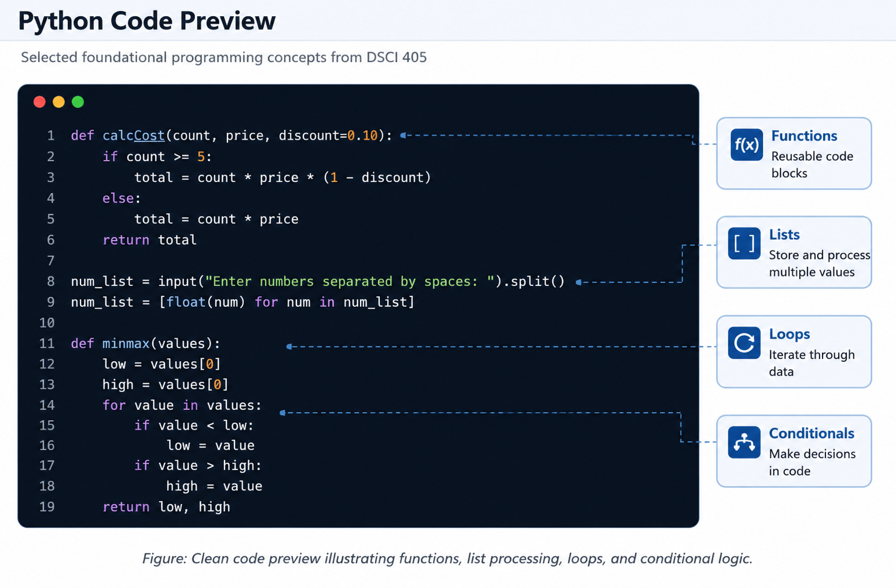
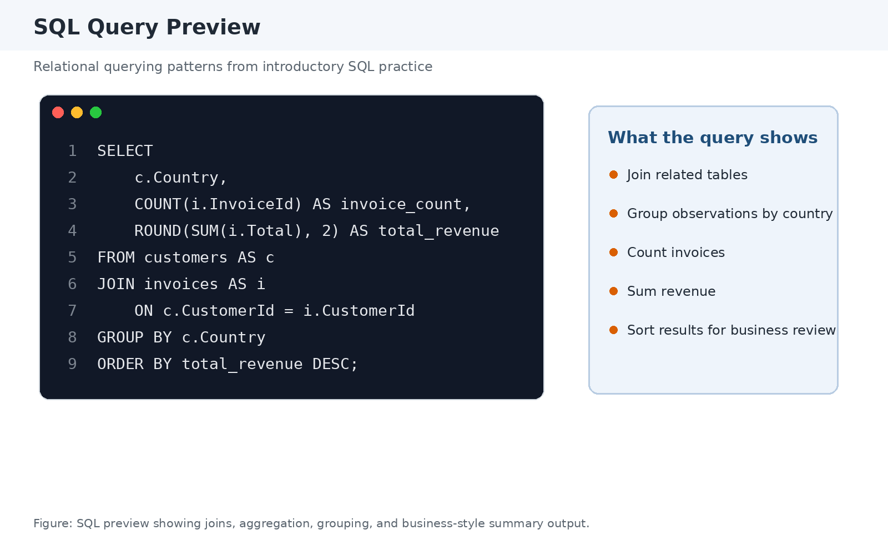

# Python and SQL Foundations

**Project type:** Technical foundations / introductory analytics coursework 
**Tools:** Python, SQL, pandas, sqlite3, matplotlib, introductory database querying 
**Status:** Completed DSCI-405 Business Analytics Fundamentals and supplemental certificates 
**My role:** Individual student

[← Back to Projects](../projects.html)

## Summary

This page documents my early technical foundation in Python, SQL, data handling, and introductory analytics. The coursework included Python programming fundamentals, SQL database querying, pandas DataFrames, basic statistical calculations, user-defined functions, and introductory data visualization.

This is not intended to be a flagship research or consulting project. Instead, it provides supporting evidence of the technical foundation behind later projects in forecasting, econometrics, optimization, and applied analytics.

## Learning Goals

The purpose of this work was to build foundational programming and data-handling skills that could support later analytics coursework and project work. These skills became useful building blocks for later work in R forecasting, Stata econometrics, Excel optimization, and applied business analytics consulting.

## Topics Covered

The coursework and supplemental certificates covered:

* Python variables and data types
* User input and output
* Conditional logic
* Loops and control flow
* Lists and basic data structures
* User-defined functions
* Basic statistical calculations
* File and database interaction
* SQLite / SQL querying
* pandas DataFrames
* Introductory data visualization
* Code organization and documentation
* Introductory SQL and Python certification work

## Why This Project Matters

This project shows the technical foundation that supports the more advanced analytical projects in this portfolio. While the work is introductory, it demonstrates comfort with programming logic, reproducible scripts, database querying, and the process of turning coursework exercises into organized portfolio artifacts.

The project is also useful because it shows learning progression. The skills documented here helped support later work involving time-series forecasting, regression analysis, dashboard preparation, and data-oriented consulting projects.

## Skills Demonstrated

* Python fundamentals
* SQL fundamentals
* pandas data handling
* sqlite3 database connection
* Basic statistical calculations
* Introductory visualization
* Code organization
* Technical self-study
* Documentation of analytical workflow

## Artifacts

* [Code portfolio PDF](../assets/files/python-sql-foundations/python-sql-foundations-code-portfolio.pdf)
* [One-page project brief](../assets/files/python-sql-foundations/python-sql-foundations-brief.pdf)
* [Introduction to Python certificate](../assets/files/python-sql-foundations/sololearn-introduction-to-python-certificate.pdf)
* [Introduction to SQL certificate](../assets/files/python-sql-foundations/sololearn-introduction-to-sql-certificate.pdf)
* [Cleaned Python code folder on GitHub](https://github.com/tysonctest/tysonctest.github.io/tree/main/assets/code/python-sql-foundations/python)
* [Cleaned SQL code folder on GitHub](https://github.com/tysonctest/tysonctest.github.io/tree/main/assets/code/python-sql-foundations/sql)

*Note: The scripts are cleaned portfolio versions of selected coursework exercises. They are included to demonstrate foundational programming logic, code organization, and early analytics workflow rather than to represent a single capstone-style project.*

## Selected Visuals

*Figure: Technical workflow connecting Python fundamentals, SQL querying, and later analytics coursework.*

*Figure: Cleaned Python script preview showing introductory programming logic and documentation style.*

*Figure: SQL query preview showing basic database-selection, filtering, grouping, and aggregation logic.*
