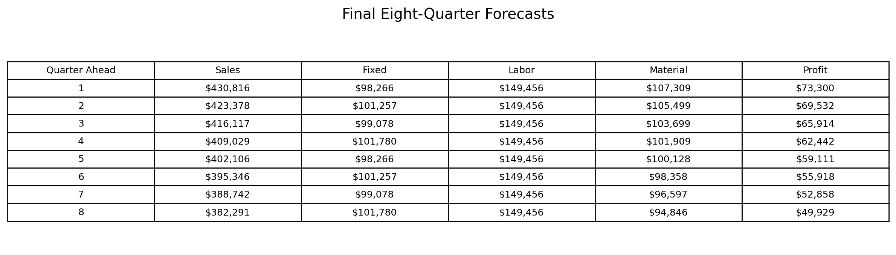
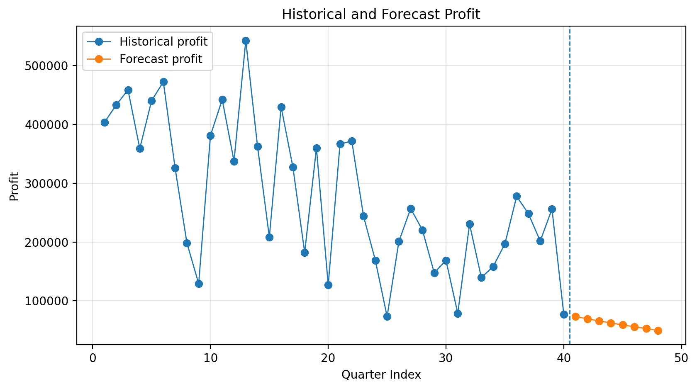
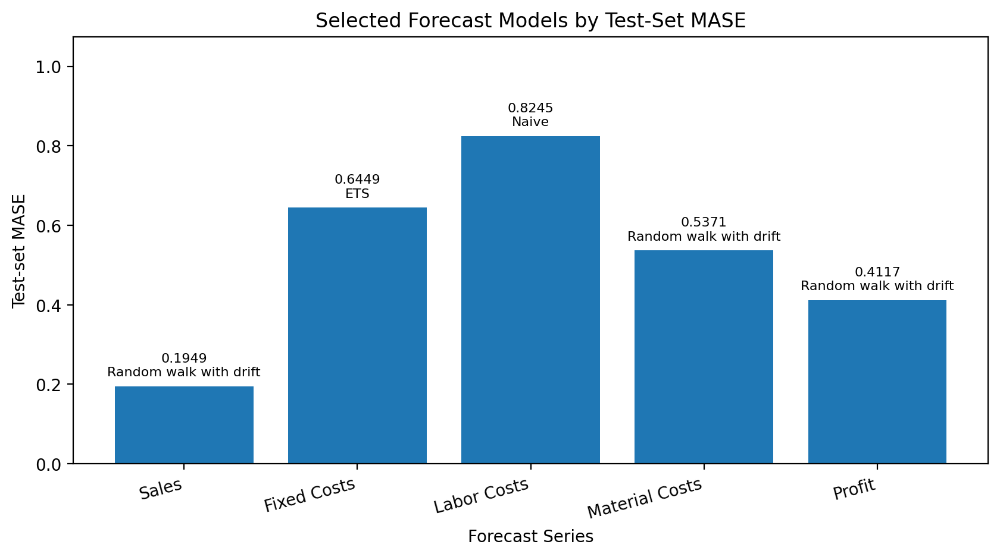

# Business Forecasting in R: Sales, Costs, and Profit

**Project type:** Applied business analytics / time-series forecasting
**Tools:** R, forecast package, time-series diagnostics, CSV business data
**Status:** Completed DSCI-430 Applied Business Analytics capstone assignments
**My role:** Individual analyst

[← Back to Projects](../projects.html)

## Summary

This project used R to forecast quarterly business performance across multiple operating series, including sales, fixed costs, labor costs, material costs, and profit. The project included exploratory time-series analysis, seasonality diagnostics, Box-Cox transformations, stationarity testing, differencing, residual diagnostics, train/test validation, and final eight-quarter forecasts.

## Problem / Research Question

How can historical quarterly business data be used to forecast future sales, costs, and profitability, and which forecasting methods produce the most reliable out-of-sample predictions?

## Data and Methods

The project analyzed quarterly business time series using R. Each series was inspected visually, tested for seasonality and stationarity, evaluated for possible variance-stabilizing transformations, and modeled using several competing forecasting methods.

Methods included:

* Quarterly time-series construction
* Exploratory time-series plots
* Seasonal and subseries plots
* Box-Cox transformation testing
* ADF and KPSS stationarity tests
* Regular and seasonal differencing checks
* ACF and residual diagnostics
* Ljung-Box tests for autocorrelation
* Train/test model evaluation
* Forecast accuracy comparison using MASE, RMSE, MAE, and MAPE
* Eight-quarter business forecasts

Models considered included naïve, seasonal naïve, random walk with drift, ETS, Holt-Winters, Auto ARIMA, TSLM, and STLF.

## Key Findings

The final forecasting work showed that no single model was best across all business series. Some series were better modeled by simple benchmark or random-walk approaches, while others required methods that captured seasonality or changing levels. In the final dataset, the forecasts suggested declining sales, declining material costs, declining profit, stable fixed costs, and flat labor costs over the next eight quarters.

## Why This Project Matters

This project demonstrates a full applied forecasting workflow: preparing data, diagnosing time-series structure, comparing candidate models, validating results out of sample, and translating forecasts into a business interpretation. It shows the ability to move beyond code output and explain what the forecast implies for business planning.

## Skills Demonstrated

* R programming
* Time-series forecasting
* Forecast accuracy evaluation
* Stationarity testing
* Residual diagnostics
* Business interpretation of model results
* Data visualization
* Technical report writing
* Code review preparation
  
## Artifacts

* [Final capstone report](../assets/files/r-forecasting-capstone/business-forecasting-r-capstone-report.pdf)
* [Cleaned R code folder on GitHub](https://github.com/tysonctest/tysonctest.github.io/tree/main/assets/code/r-forecasting-capstone)

## Code Files

The cleaned R workflow is documented in the README and split into three forecasting scripts:

* [Code README on GitHub](https://github.com/tysonctest/tysonctest.github.io/blob/main/assets/code/r-forecasting-capstone/README.md)
* [01_first_sales_dataset_forecasting.R](https://github.com/tysonctest/tysonctest.github.io/blob/main/assets/code/r-forecasting-capstone/01_first_sales_dataset_forecasting.R)
* [02_second_sales_dataset_forecasting.R](https://github.com/tysonctest/tysonctest.github.io/blob/main/assets/code/r-forecasting-capstone/02_second_sales_dataset_forecasting.R)
* [03_third_sales_dataset_profit_forecasting.R](https://github.com/tysonctest/tysonctest.github.io/blob/main/assets/code/r-forecasting-capstone/03_third_sales_dataset_profit_forecasting.R)

*Note: Raw class CSV datasets are not included in this public portfolio package. The scripts use relative paths and document where the data files should be placed to reproduce the workflow.*

## Selected Visuals

*Figure: Final eight-quarter forecasts for sales, fixed costs, labor costs, material costs, and profit.*

*Figure: Historical profit series and eight-quarter profit forecast.*

*Figure: Selected forecast models by test-set MASE for each business series.*
