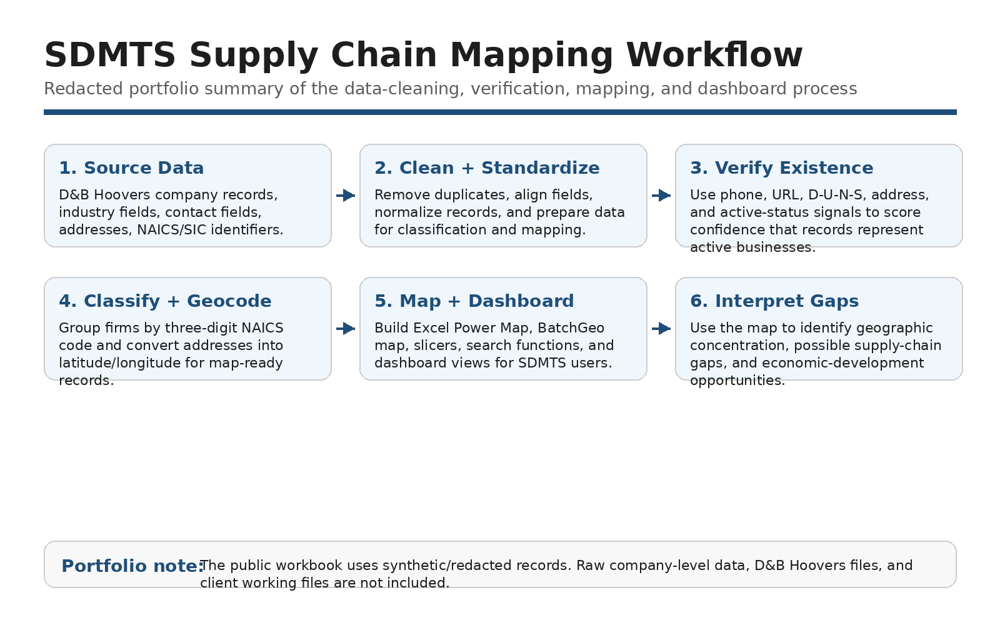
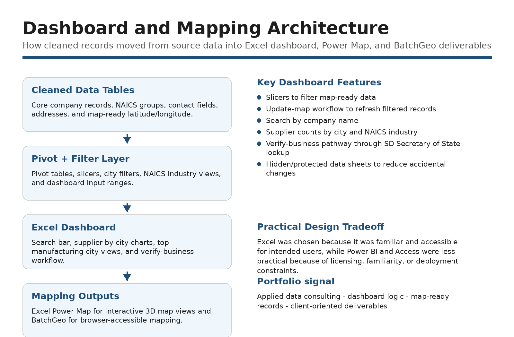
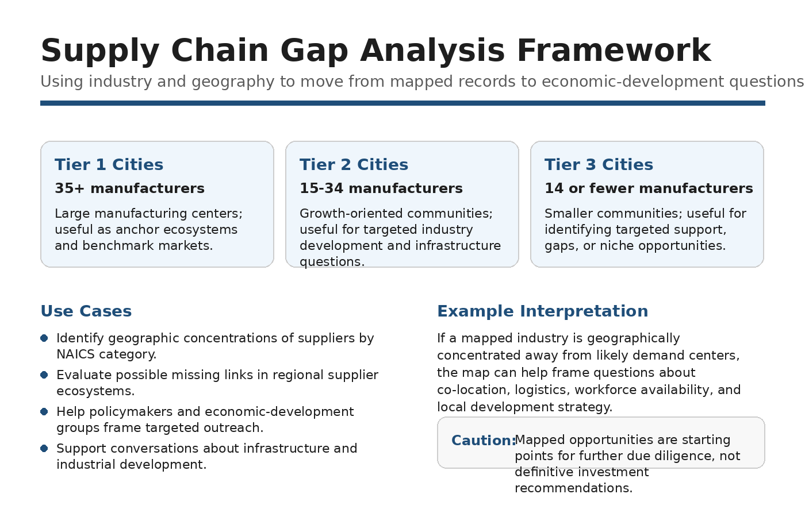

# South Dakota Manufacturing Supply Chain Mapping

**Project type:** Client-facing consulting / supply-chain mapping / applied data analysis
**Tools:** Excel, data cleaning, D&B Hoovers-style firm data, mapping tools, dashboard design, regional economic analysis
**Status:** Completed consulting project for South Dakota Manufacturing & Technology Solutions
**My role:** Team consultant; interpretation, writing, presentation development, and client-facing recommendation support

[← Back to Projects](../projects.html)

## Summary

This project supported South Dakota Manufacturing & Technology Solutions by helping organize and interpret manufacturing and supply-chain data for use in regional economic-development planning. The project involved firm-level data review, supply-chain categorization, geographic interpretation, and dashboard-oriented thinking to help stakeholders better understand manufacturing clusters, supplier relationships, and potential gaps in the regional supply chain.

The final deliverables were designed for a client audience. The goal was to help turn complex business and location data into usable information for stakeholders interested in manufacturing strategy, supplier discovery, and regional development opportunities.

## Role Note

This was a team consulting project with shared technical and client-facing responsibilities. My primary contributions centered on interpreting the analysis, developing the written and presentation deliverables, and translating the findings into client-facing recommendations. The project is included here as an example of applied data consulting, supply-chain mapping, and regional economic analysis.

## Problem / Research Question

How can manufacturing and supplier data be organized, verified, and visualized to help stakeholders better understand South Dakota’s manufacturing supply-chain landscape?

## Data and Methods

The project worked with business establishments and manufacturing-related data to organize firms by geography, industry classification, and supply-chain relevance. The analysis focused on cleaning and structuring data so it could be used for mapping, dashboard review, and client-facing interpretation.

Methods included:

* Firm-level data review and organization
* Supply-chain classification and interpretation
* NAICS-based industry grouping
* Geographic mapping and regional segmentation
* Data-quality and existence-verification logic
* Dashboard and map interpretation
* Gap-analysis framing
* Client-facing synthesis and recommendation development

## Key Findings

The project helped organize manufacturing and supply-chain information in a form that could be used to better understand regional clusters, potential gaps, and economic-development opportunities. The final deliverables were intended to help stakeholders think more clearly about where supplier relationships, industry concentrations, and regional development opportunities may exist.

## Why This Project Matters

This project demonstrates experience working on a real client-facing analytics problem involving messy business data, mapping, supply-chain interpretation, and economic-development strategy. It also shows the importance of translating technical outputs into recommendations that nontechnical stakeholders can use.

## Skills Demonstrated

* Team consulting
* Supply-chain analysis
* Applied data cleaning
* NAICS and industry classification
* Geographic and regional interpretation
* Dashboard and map interpretation
* Economic-development analysis
* Professional writing
* Presentation preparation
* Stakeholder communication
* Recommendation framing

## Artifacts

* [Redacted project report](../assets/files/sdmts-supply-chain/sdmts-supply-chain-report.pdf)
* [One-page project brief](../assets/files/sdmts-supply-chain/sdmts-supply-chain-brief.pdf)
* [Methods note](../assets/files/sdmts-supply-chain/sdmts-supply-chain-methods-note.pdf)
* [Redacted workbook demo](../assets/files/sdmts-supply-chain/sdmts-supply-chain-workbook-demo.xlsx)

*Note: This portfolio package does not include raw company-level data, D&B Hoovers records, or the original macro-enabled client workbook. The workbook demo uses synthetic/redacted records to illustrate the workflow without publishing sensitive or non-public firm-level information.*

## Selected Visuals

*Figure: Overview of the firm-level verification and supply-chain data-cleaning workflow.*

*Figure: Dashboard structure for translating supply-chain data into stakeholder-facing views.*

*Figure: Framework for using mapped supplier data to identify regional supply-chain gaps and opportunities.*
