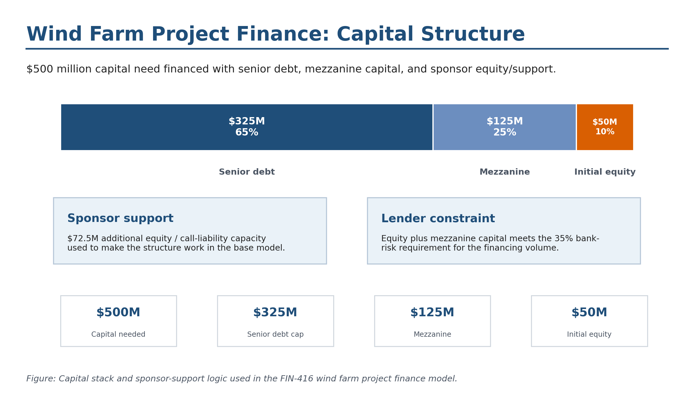
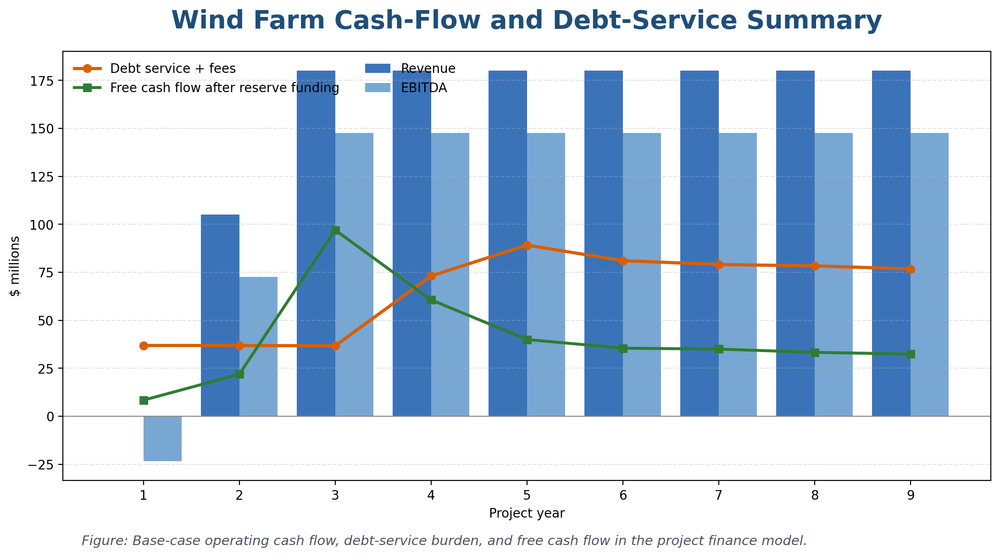
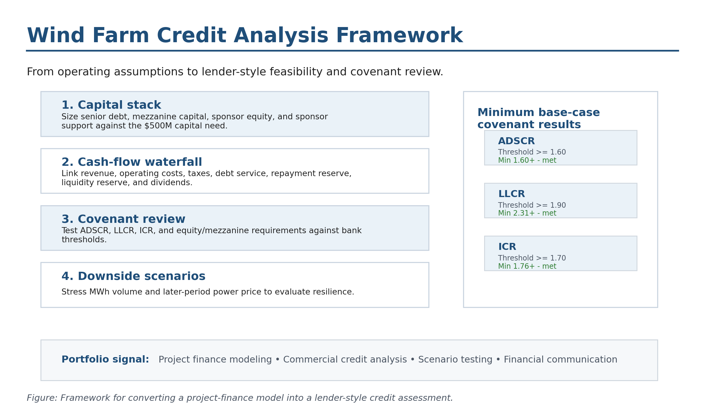

# Wind Farm Project Finance Case Study

**Project type:** Commercial bank management / project finance case study 
**Tools:** Excel, project finance template, debt-service analysis, covenant analysis, sensitivity analysis 
**Status:** Completed FIN-416 Commercial Bank Management project 
**My role:** Completed and interpreted an instructor-provided project-finance model template

[← Back to Projects](../projects.html)

## Summary

This project evaluated the financial feasibility of a proposed wind-power facility in South Dakota. The assignment simulated a commercial bank project-finance analysis, requiring evaluation of capital structure, debt repayment, reserves, covenants, sensitivity analysis, scenario analysis, and sponsor return targets.

The project was designed to build lender-style credit analysis skills. Rather than simply asking whether the project could generate positive cash flow, the assignment required evaluating whether the project could support a bankable financing structure under required debt-service and covenant constraints.

## Problem / Research Question

Can a proposed wind farm support a viable project-finance structure while satisfying bank covenants, maintaining sufficient reserves, and meeting sponsor return expectations?

## Data and Methods

The project used an instructor-provided Excel template with required inputs and adjustable financing assumptions. The analysis focused on completing the model, adjusting financing instruments, testing covenant compliance, and evaluating whether the project remained feasible under downside scenarios.

Methods included:

* Project-finance cash-flow analysis
* Senior debt and mezzanine capital structuring
* Equity requirement evaluation
* Debt repayment schedule review
* IRR / rate-of-return analysis
* Loan-life cover ratio review
* Annual debt service cover ratio review
* Interest coverage ratio review
* Reserve-account and covenant review
* Sensitivity analysis
* Scenario analysis

## Important Framing Note

This project used a structured Excel template provided for the class. I would not describe this as a project-finance model built from scratch. My contribution was completing the required model inputs, adjusting financing assumptions, evaluating covenant compliance, and interpreting the results.

The public workbook included here is a cleaned demonstration artifact. It is designed to show the project-finance logic and selected model outputs without presenting the original working template as a fully self-built financial model.

## Key Findings

The case required identifying a financing plan that could support the project while meeting lender requirements and sponsor return expectations. The project also tested whether the wind farm could remain viable under lower electricity production and lower price assumptions.

The analysis highlighted the importance of debt-service capacity, reserves, and downside protection in infrastructure lending. A project can appear attractive at the headline return level but still require careful structuring to satisfy lender covenants and maintain resilience under stress scenarios.

## Why This Project Matters

This project demonstrates exposure to commercial banking, infrastructure finance, lender risk management, covenant analysis, and project-finance logic. It is especially relevant to credit analysis, public finance, infrastructure finance, energy finance, and banking-oriented career paths.

It also complements the rest of the portfolio by showing a finance-oriented analytical workflow: moving from a structured model to a credit-style interpretation of capital structure, repayment capacity, covenant compliance, and project risk.

## Skills Demonstrated

* Project finance
* Commercial bank management
* Debt-service analysis
* Covenant interpretation
* IRR analysis
* Capital-structure evaluation
* Sensitivity analysis
* Scenario analysis
* Excel-based financial modeling
* Credit-risk thinking
* Lender-style written interpretation

## Artifacts

* [Case-study report](../assets/files/wind-farm-finance/wind-farm-finance-case-study.pdf)
* [One-page project brief](../assets/files/wind-farm-finance/wind-farm-finance-brief.pdf)
* [Methods note](../assets/files/wind-farm-finance/wind-farm-finance-methods-note.pdf)
* [Cleaned workbook demo](../assets/files/wind-farm-finance/wind-farm-finance-workbook-demo.xlsx)

*Note: The workbook is a cleaned portfolio demonstration of the project-finance analysis. It is included to show selected financing logic, covenant review, and scenario-analysis structure rather than to present the original course template as a fully self-built model.*

## Selected Visuals

*Figure: Capital-structure summary showing debt, mezzanine financing, and equity components.*

*Figure: Selected cash-flow and debt-service indicators from the wind-farm finance case.*

*Figure: Lender-style framework for evaluating project finance feasibility, covenant compliance, and downside risk.*
